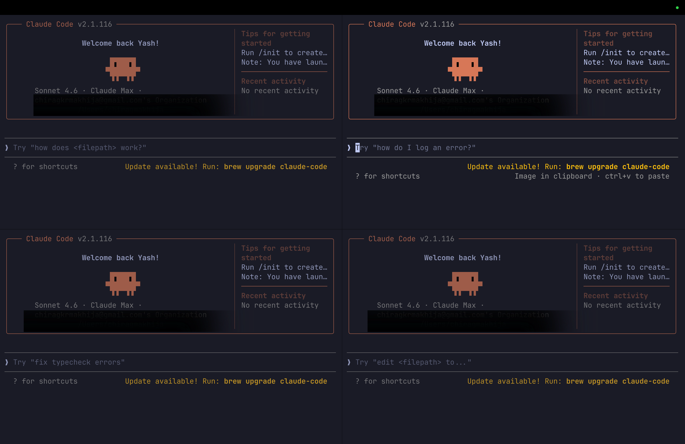

# claude-terminals

One command to open a multi-pane Claude Code workspace in your current directory.

```
c terminal 4
```



## Install

```bash
curl -fsSL https://raw.githubusercontent.com/yashmakhija/claude-terminals/main/install.sh | bash
```

Then reload your shell:

```bash
source ~/.zshrc
```

## Usage

Run from inside your project directory:

```bash
c terminal 4    # 4 panes — claude in each
c terminal 2    # 2 panes side by side
c terminal 3    # 3 panes
c terminal 1    # 1 pane
```

## Layout

```
┌─────────────┬─────────────┐
│   claude    │   claude    │
├─────────────┼─────────────┤
│   claude    │   claude    │
└─────────────┴─────────────┘
```

## Requirements

- **macOS + [Ghostty](https://ghostty.org)** — uses Ghostty's native splits via AppleScript
- **tmux** — fallback for any other terminal (`brew install tmux`)

For the tmux fallback, navigation is pre-configured — no tmux knowledge needed:

| Action | How |
|---|---|
| Switch pane | Click with mouse, or Alt+Arrow |
| Close pane | Ctrl+D |
| Resize pane | Ctrl+Alt+Arrow |

## How it works

1. **Inside Ghostty** — uses Ghostty's AppleScript API to create native splits. Each pane starts in your project directory with `claude` already running.
2. **Any other terminal** — creates a tmux session with mouse support and Alt+Arrow navigation built in.

## Claude Code hook (optional)

Shows a reminder tip when you open Claude outside a prepared workspace. Add to `~/.claude/settings.json`:

```json
"hooks": {
  "SessionStart": [
    {
      "matcher": "",
      "hooks": [
        {
          "type": "command",
          "command": "if [[ -z \"$TMUX\" && -z \"$GHOSTTY_WINDOW_ID\" ]]; then echo 'Tip: Run `c terminal 4` to set up your workspace'; fi"
        }
      ]
    }
  ]
}
```
